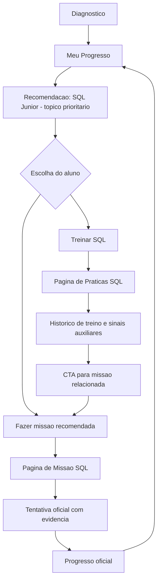
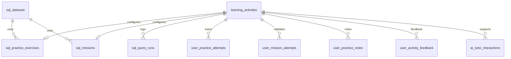

# Decisao de Produto e Arquitetura - Praticas e Missoes SQL

## 1. Resumo executivo

Esta decisao separa tres responsabilidades que hoje estao muito proximas no produto:

- Praticas e exercicios SQL: ambiente de treino, repeticao, erro, dica, solucao comentada e anotacao.
- Missoes SQL: validacao oficial de desempenho, com tentativa, resultado e evidencia.
- Meu Progresso: painel orientador que recomenda a proxima acao e consolida apenas progresso confiavel.

A regra principal e simples: pratica gera sinais de aprendizado, mas nao conta diretamente para progresso oficial. Missao gera evidencia e pode contar para progresso oficial.

O estado atual do Data Skill Map ja permite testar o ciclo minimo com diagnostico, Meu Progresso, recomendacao de pratica, PGlite local e validacao SQL em dados sinteticos. Antes de persistir tentativas ou criar novas telas, a plataforma precisa nomear corretamente esses conceitos e decidir quais dados alimentam historico, recomendacao e progresso.

Este documento e apenas uma proposta tecnica/produto. Nenhuma migration foi criada, nenhuma tabela foi alterada e nenhuma integracao de IA foi implementada.

## 2. Problema atual

A pagina atual `missao.html`, implementada por `src/learning-mission-page.js`, funciona como prototipo local do piloto SQL. O proprio codigo registra a premissa: dados controlados em memoria, sem Supabase e sem progresso real.

Ao mesmo tempo, a experiencia mistura dois papeis:

- Treino: o aluno pode testar, errar, receber feedback e repetir.
- Validacao: o nome "missao" sugere uma etapa oficial que deveria contar para progresso.

Essa mistura cria risco de produto e arquitetura:

- O aluno pode achar que concluiu uma etapa oficial quando apenas treinou localmente.
- O sistema pode acabar inflando progresso se registrar pratica como conclusao.
- O historico de aprendizagem pode perder granularidade entre tentativa livre e tentativa oficial.
- Solucoes, regras de validacao e respostas podem ser expostas cedo demais no frontend.

## 3. Estado atual avaliado

Arquivos e estruturas identificados localmente:

- Paginas HTML: `index.html`, `diagnostico.html`, `meu-progresso.html`, `missao.html`, `analytics.html`.
- Diagnostico: `src/quiz.js`, `src/question-selector.js`, `src/question-bank-service.js`, `src/diagnostic-funnel-service.js`, `src/recommendations.js`.
- Meu Progresso: `src/progress-page.js`, `styles/progress.css`.
- Aprendizado personalizado: `src/personalized-learning-service.js`, `src/learning-paths.js`.
- Missao SQL/PGlite: `src/learning-mission-page.js`, `src/sql-poc-engine.js`, `src/sql-mission-validation.js`.
- Supabase/Auth: `src/supabase-service.js`, `src/supabase-config.js`, `src/auth-service.js`, `src/auth-modal.js`.
- SQL versionado/documental: arquivos `docs/supabase-*.sql`.
- Testes SQL existentes: `scripts/test-sql-mission-validation.js` e `scripts/test-sql-poc-engine.js`, expostos em `package.json`.

Tabelas e views conhecidas aparecem no codigo ou na documentacao versionada:

- `admin_users`
- `profiles`
- `diagnostic_sessions`
- `diagnostic_answers`
- `diagnostic_funnel_events`
- `diagnostic_recommendations`
- `challenge_attempts`
- `satisfaction_feedback`
- `question_bank`
- `learning_paths`
- `learning_path_steps`
- `user_learning_progress`
- `user_skill_progress`
- `learning_recommendations`
- `vw_user_activity_daily`
- `vw_platform_activity_daily`
- `vw_satisfaction_feedback_daily`
- `vw_satisfaction_comments_admin`

Nao foi feita consulta remota ao Supabase nesta tarefa. A analise usou apenas arquivos locais/versionados.

## 4. Decisao de produto

Separar oficialmente pratica e missao.

Praticas SQL servem para treinar. O aluno pode errar, repetir, consultar dica, ver solucao, fazer anotacoes e executar queries. Essas interacoes devem formar historico de treino e sinais auxiliares.

Missoes SQL servem para validar desempenho. Elas devem ser vinculadas a habilidade, nivel e topico, gerar tentativa oficial e alimentar o Meu Progresso quando houver evidencia confiavel.

Meu Progresso deve orientar o aluno e apresentar a proxima etapa recomendada. Em vez de um unico caminho, pode oferecer duas acoes:

- Treinar agora.
- Fazer missao.

O painel deve consultar progresso oficial para evolucao e usar pratica apenas como sinal auxiliar, por exemplo para recomendar revisao, liberar tentativa de missao ou indicar prontidao.

## 5. Fluxo recomendado

## 6. Diferenca entre pratica e missao

| Aspecto | Pratica / exercicio SQL | Missao SQL |
| --- | --- | --- |
| Objetivo | Treinar e explorar | Validar desempenho |
| Erro | Esperado e parte do aprendizado | Conta como tentativa oficial |
| Dicas | Permitidas | Restritas ou controladas |
| Solucao | Pode ser liberada | Nao deve ser exposta antes da validacao |
| Repeticao | Livre | Controlada por tentativa |
| Persistencia | Historico de treino | Evidencia oficial |
| Progresso oficial | Nao conta diretamente | Pode contar |
| Uso no Meu Progresso | Sinal auxiliar | Fonte de evolucao |

## 7. O que salvar e o que conta para progresso

### Praticas SQL

Salvar:

- Usuario.
- Atividade praticada.
- Topico, nivel e habilidade.
- Queries executadas.
- Status de execucao.
- Erros de sintaxe ou execucao.
- Resultado resumido: colunas, quantidade de linhas e tempo.
- Uso de dica.
- Visualizacao de solucao.
- Tentativas livres.
- Anotacoes pessoais.
- Feedback do aluno: dificuldade, confianca e comentario.
- Sinais comportamentais: repeticao, muitos erros, uso frequente de dica, prontidao para missao.

Nao contar diretamente:

- Abrir pratica.
- Executar query livre.
- Marcar `completed_soft`.
- Ver solucao.
- Salvar anotacao.

### Missoes SQL

Salvar:

- Usuario.
- Atividade/missao oficial.
- Habilidade, nivel e topico.
- Tentativa oficial.
- Query submetida.
- Resultado da validacao.
- Status: iniciada, submetida, aprovada ou reprovada.
- Score, acerto/erro e resumo da validacao.
- Evidencias de validacao.
- Data de inicio e envio.

Pode contar para progresso oficial:

- Missao aprovada com validacao confiavel.
- Tentativa oficial submetida e avaliada.
- Evidencia vinculada a habilidade e nivel.

## 8. Como praticas e missoes se conectam

Pratica e missao devem compartilhar chaves conceituais:

- `area`
- `skill_code`
- `level`
- `topic`
- `activity_id` ou relacionamento equivalente

Exemplo:

- Pratica: SQL Junior - SELECT basico, `skill_code = sql_select_basico`, `activity_type = practice`.
- Missao: Missao SQL Junior - SELECT basico, `skill_code = sql_select_basico`, `activity_type = mission`.

A pratica pode ter CTA "Fazer missao relacionada". A missao pode ter CTA "Voltar para praticar este assunto".

Se o aluno falhar na missao, o sistema pode recomendar revisar a pratica relacionada, tentar outro exercicio do mesmo topico ou consultar uma explicacao.

## 9. Como o Meu Progresso deve usar essas informacoes

Meu Progresso deve continuar sendo o painel de orientacao.

Ele deve:

- Mostrar prioridade atual do aluno.
- Mostrar a proxima etapa recomendada.
- Diferenciar "treino recomendado" de "missao oficial".
- Usar tentativas oficiais para evolucao e progresso.
- Usar praticas como contexto auxiliar.
- Evitar marcar progresso apenas por clique, visualizacao ou treino livre.

Exemplo de leitura:

- O aluno treinou muito `WHERE`, usou poucas dicas e acertou validacoes locais: recomendar "Fazer missao WHERE".
- O aluno falhou na missao `WHERE`: recomendar "Revisar pratica WHERE" ou "Tentar exercicio guiado".
- O aluno concluiu missao oficial: atualizar progresso de SQL Junior e recomendar proximo topico.

## 10. Pagina futura de Praticas SQL

A futura pagina de Praticas SQL deve ser a area de treino. Ela nao substitui a missao oficial.

Papel da pagina:

- Listar exercicios por nivel e topico.
- Permitir filtro por dificuldade, assunto e status.
- Abrir uma pratica com editor SQL/PGlite.
- Permitir dica, solucao comentada e anotacoes.
- Salvar historico de treino quando houver estrutura segura.
- Direcionar para missao relacionada.

## 11. Como a pagina de Missao SQL deve se diferenciar

A pagina de Missao SQL deve ter linguagem e regras de validacao oficial.

Ela deve:

- Mostrar criterio de conclusao.
- Informar se a tentativa conta para progresso.
- Controlar tentativas.
- Evitar expor solucao ou regra sensivel.
- Registrar evidencia oficial quando persistencia estiver pronta.
- Alimentar `user_learning_progress` e `user_skill_progress` apenas depois de validacao confiavel.

## 12. Tabelas atuais avaliadas

### `learning_paths`

Serve bem como agrupador/catalogo de trilhas. Pode continuar representando SQL Essencial, SQL Junior ou outros caminhos. Nao deve ser fonte de evidencia de conclusao.

### `learning_path_steps`

Pode apontar para conteudos, praticas ou missoes por `content_type`, `content_url` e `step_key`. Serve como ponte de navegacao e organizacao, mas nao deve provar estudo por si so.

### `user_learning_progress`

Deve representar progresso oficial ou agregado de trilha. Nao deve registrar pratica livre como conclusao direta. Pode ser atualizado a partir de missao oficial aprovada ou consolidacao confiavel.

### `user_skill_progress`

Boa estrutura para consolidar evolucao por area/habilidade. Deve receber dados derivados de diagnosticos e missoes oficiais, nao de qualquer treino livre isolado.

### `learning_recommendations`

Boa estrutura para guardar recomendacoes ativas. Pode recomendar pratica, revisao, missao ou proxima trilha. Nao deve ser marcada como concluida sem evidencia.

### `challenge_attempts`

Pode registrar desafios legados, mas usar esta tabela para praticas livres tende a misturar conceitos. Ela pode ser reaproveitada apenas se o produto decidir que "desafio" e um tipo de tentativa avaliada. Para treino SQL livre, uma tabela propria e mais clara.

### `diagnostic_sessions` e `diagnostic_answers`

Continuam como fonte da verdade do diagnostico. Devem orientar recomendacoes, mas nao devem armazenar execucoes SQL.

### `question_bank`

Serve para perguntas do diagnostico/desafios. Pode inspirar taxonomia de habilidades, mas nao deve virar catalogo de atividades SQL.

### `diagnostic_recommendations`

Boa camada para conectar lacunas do diagnostico a recomendacoes, habilidades e topicos. Pode apontar para pratica ou missao recomendada por `skill_code`.

## 13. Opcoes de modelo relacional

### Opcao A - Reaproveitamento maximo

Reaproveitar o maximo possivel:

- `learning_paths` como trilha.
- `learning_path_steps` como item que aponta para pratica ou missao.
- `learning_recommendations` como recomendacao ativa.
- `user_learning_progress` e `user_skill_progress` como agregados.
- `challenge_attempts` para algum historico de resposta.

Vantagens:

- Menor mudanca inicial.
- Reaproveita codigo e conceitos existentes.
- Ajuda a testar fluxo rapidamente.

Riscos:

- `challenge_attempts` pode nao representar pratica livre.
- `user_learning_progress` pode ser contaminado por treino sem evidencia.
- `learning_path_steps` pode virar uma tabela generica demais.
- Fica dificil separar "treinou" de "validou oficialmente".
- Indicadores oficiais podem inflar.

Conclusao: boa para piloto muito curto, ruim como base de medio prazo se a plataforma quiser historico serio de aprendizado.

### Opcao B - Modelo recomendado para medio prazo

Criar uma camada limpa, sem aplicar agora:

Tabelas sugeridas:

1. `learning_activities`
   Catalogo generico de atividades. Campos: `id`, `activity_type`, `area`, `skill_code`, `level`, `title`, `description`, `status`, `estimated_minutes`, `display_order`, `created_at`, `updated_at`.

2. `sql_practice_exercises`
   Configuracao de exercicios SQL livres. Campos: `id`, `activity_id`, `dataset_id`, `prompt`, `complementary_info`, `expected_concepts`, `starter_query`, `hint_text`, `solution_query`, `validation_mode`, `difficulty`, `allow_solution`, `allow_hints`, `created_at`, `updated_at`.

3. `sql_missions`
   Configuracao de missoes oficiais SQL. Campos: `id`, `activity_id`, `dataset_id`, `prompt`, `business_context`, `expected_result_definition`, `validation_rules`, `max_attempts`, `counts_toward_progress`, `created_at`, `updated_at`.

4. `sql_datasets`
   Controle dos datasets sinteticos. Campos: `id`, `name`, `description`, `version`, `source_type`, `schema_definition`, `seed_reference`, `is_active`, `created_at`, `updated_at`.

5. `sql_query_runs`
   Historico de execucoes SQL. Campos: `id`, `user_id`, `activity_id`, `run_context`, `attempt_id`, `query_text`, `execution_status`, `execution_error`, `returned_columns`, `returned_row_count`, `execution_time_ms`, `validation_status`, `created_at`.

6. `user_practice_attempts`
   Tentativas de pratica livre. Campos: `id`, `user_id`, `activity_id`, `started_at`, `last_run_at`, `completed_soft`, `total_runs`, `used_hint`, `viewed_solution`, `perceived_difficulty`, `confidence_level`, `created_at`, `updated_at`.

7. `user_mission_attempts`
   Tentativas oficiais de missao. Campos: `id`, `user_id`, `activity_id`, `started_at`, `submitted_at`, `status`, `score`, `passed`, `official_attempt`, `query_text`, `validation_summary`, `created_at`, `updated_at`.

8. `user_practice_notes`
   Anotacoes pessoais. Campos: `id`, `user_id`, `activity_id`, `note_text`, `visibility`, `created_at`, `updated_at`.

9. `user_activity_feedback`
   Feedback do aluno. Campos: `id`, `user_id`, `activity_id`, `feedback_context`, `perceived_difficulty`, `rating`, `comment`, `created_at`.

10. `ai_tutor_interactions`
    Registro futuro de IA tutora. Campos: `id`, `user_id`, `activity_id`, `interaction_context`, `provider`, `model`, `prompt_summary`, `response_summary`, `tokens_input`, `tokens_output`, `status`, `created_at`.

Conclusao: a Opcao B e a mais limpa para medio prazo. Ela separa catalogo, treino, missao oficial, execucao SQL, notas, feedback e IA.

## 14. Diretrizes de RLS e seguranca

Diretrizes futuras, sem aplicar agora:

- Usuario so pode ver suas proprias tentativas.
- Usuario so pode ver suas proprias anotacoes.
- Usuario so pode inserir registros com `user_id = auth.uid()`.
- Catalogo de praticas/missoes pode ser publico para leitura apenas se nao expuser resposta, solucao ou regra sensivel.
- Solucoes oficiais nao devem ser expostas diretamente no frontend sem criterio.
- Regras de validacao sensiveis devem ficar em camada controlada.
- Queries devem executar em PGlite/local/sintetico, nunca no banco de producao.
- Se salvar query do aluno, informar que isso faz parte do historico de aprendizado.
- Pratica livre nao deve inflar progresso oficial.
- Views admin devem continuar restritas conforme o modelo de `admin_users` e views administrativas.

## 15. IA futura

IA tutora e uma evolucao futura, nao requisito para o MVP de praticas.

Ela pode ajudar em:

- Explicar erro da query.
- Dar dica sem entregar a solucao completa.
- Explicar conceito da pratica.
- Revisar query enviada.
- Sugerir proximo topico.
- Gerar explicacao curta do resultado.

Arquitetura segura recomendada:

- Frontend chama uma camada server-side.
- A camada server-side pode ser Supabase Edge Function, Vercel Function, Netlify Function ou outro proxy.
- Chaves de IA nunca ficam no frontend.
- Aplicar rate limit, controle de custo e logs minimos.
- Nao enviar dados sensiveis do usuario para IA.
- Salvar preferencialmente resumo, metadados, status e custos, nao necessariamente prompt/resposta completos.

## 16. Anotacoes e feedback do aluno

Anotacoes devem ser privadas por padrao.

`user_practice_notes` deve guardar texto pessoal do aluno, associado a uma atividade. A visibilidade inicial deve ser `private`.

`user_activity_feedback` deve guardar dificuldade percebida, confianca, nota e comentario opcional. Esse feedback ajuda curadoria de exercicios e recomendacao, mas nao deve ser confundido com acerto oficial.

## 17. Layout recomendado para a pagina de pratica

### Desktop

Topo:

- Header do Data Skill Map.
- Breadcrumb: Meu Progresso > Praticas SQL > SELECT basico.
- Titulo da pratica.
- Nivel, topico, dificuldade e status.

Corpo em duas colunas:

Coluna esquerda:

- Enunciado.
- Objetivo da pratica.
- Informacoes complementares.
- Schema/tabelas disponiveis.
- Exemplo de estrutura dos dados, se necessario.
- Dica rapida.
- Solucao comentada, se liberada.
- Anotacoes pessoais.
- Feedback do aluno: dificuldade, confianca e comentario opcional.

Coluna direita:

- Editor SQL/terminal de consulta.
- Botoes: Executar query, Limpar, Ver dica, Ver solucao, Salvar anotacao, Fazer missao relacionada.
- Area de resultado: tabela retornada, erro, feedback de validacao e resumo da execucao.

### Mobile

- Empilhar em uma coluna.
- Enunciado primeiro.
- Editor logo depois.
- Resultado abaixo do editor.
- Anotacoes e feedback no fim.
- Evitar overflow horizontal.
- Resultado em tabela com scroll controlado.

## 18. Fases recomendadas de implementacao

### Fase 0 - Decisao/documentacao

- Documento atual.
- Nenhuma alteracao funcional.

### Fase 1 - Ajuste conceitual da missao atual

- Melhorar clareza da missao SQL atual.
- Deixar explicito se ela e pratica ou missao.
- Nao persistir progresso se nao houver estrutura confiavel.

### Fase 2 - Pagina de Praticas SQL

- Criar pagina de treino.
- Reaproveitar PGlite local.
- Salvar historico de pratica se tabelas e RLS estiverem seguras.
- Nao contar progresso oficial.

### Fase 3 - Missoes oficiais SQL

- Separar tentativa oficial.
- Salvar resultado.
- Contar progresso com evidencia.
- Integrar Meu Progresso.

### Fase 4 - IA tutora e anotacoes avancadas

- Explicacao de erro.
- Dicas graduais.
- Revisao de query.
- Resumo de aprendizado.
- Controle de uso/custo.

### Fase 5 - Expansao

- Mais topicos Junior.
- Depois Pleno.
- Depois Senior.
- Futuramente Estatistica, Excel, Indicadores e Logica.

## 19. Riscos e cuidados

- Criar links soltos para praticas sem fluxo claro.
- Marcar progresso real sem persistencia confiavel.
- Executar SQL contra banco de producao.
- Expor solucoes e regras de validacao no frontend.
- Usar pratica livre como progresso oficial.
- Criar muitas telas antes de validar ciclo minimo.
- Registrar dados demais de IA, aumentando custo e risco de privacidade.
- Tratar `learning_path_steps` como evidencia de conclusao.

## 20. Proxima implementacao recomendada

A proxima implementacao real recomendada e uma "Pagina de Praticas SQL" ou "Central SQL" pequena, acessivel pelo Meu Progresso e conectada a topicos SQL Junior.

Recorte inicial sugerido:

- 5 a 10 praticas Junior.
- Filtros por nivel/topico.
- Uma pratica abre editor PGlite local.
- Historico inicialmente local ou persistido somente depois de RLS revisada.
- CTA para missao relacionada.
- Progresso oficial continua intocado ate existir tentativa oficial confiavel.

Antes de implementar, decidir se a missao atual deve ser renomeada conceitualmente como pratica guiada piloto ou promovida a missao oficial apenas depois de persistencia e validacao server-side.
